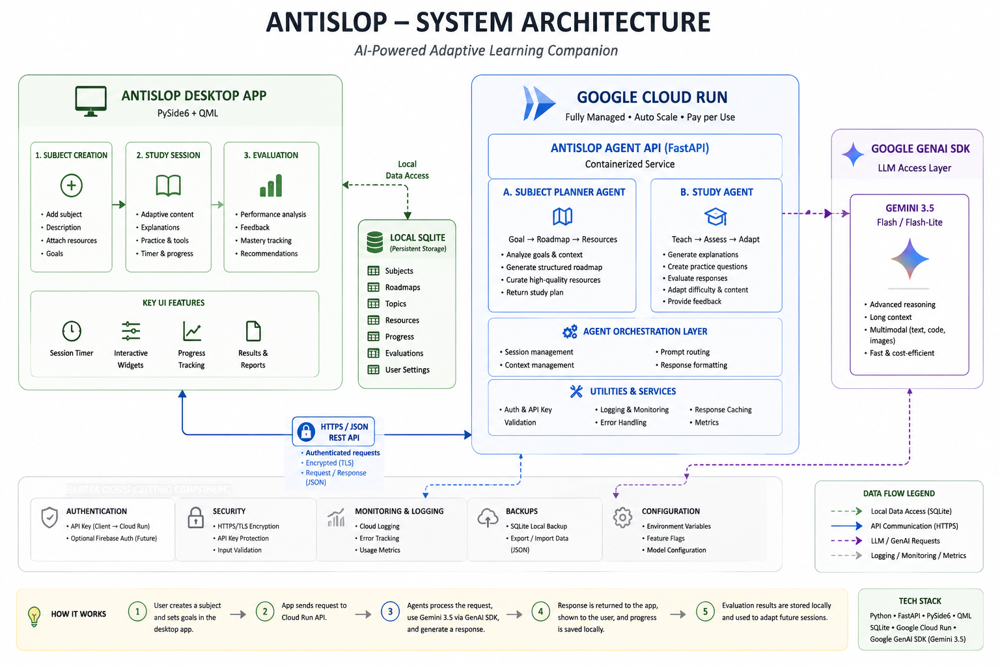

# Antislop

Antislop is an adaptive AI study agent that generates learning roadmaps, finds resources, creates interactive study sessions, evaluates the learner, and adapts future sessions based on their progress.

Built for the **All Things Agentic Hackathon**.

## Architecture



## How to build

```powershell
git clone https://github.com/icountbackwards/Anti-slop.git
cd Antislop

python -m venv .venv
.venv\Scripts\activate
pip install -r requirements.txt

$env:GEMINI_API_KEY="YOUR_API_KEY"

uvicorn server:app --reload --port 8080

.venv\Scripts\activate
python main.py
```

### Run from Cloud

The same FastAPI backend can be deployed to Google Cloud Run. Set `ANTISLOP_API_URL` to the generated Cloud Run service URL to run the desktop client against the cloud-hosted agent.


```powershell
gcloud.cmd auth login
gcloud.cmd config set project YOUR_PROJECT_ID
gcloud.cmd services enable run.googleapis.com cloudbuild.googleapis.com artifactregistry.googleapis.com
$env:GEMINI_API_KEY="YOUR_GEMINI_API_KEY"
gcloud.cmd run deploy antislop-agent --source . --region asia-east1 --allow-unauthenticated --set-env-vars "GEMINI_API_KEY=$env:GEMINI_API_KEY"
$env:ANTISLOP_API_URL="YOUR_CLOUD_RUN_URL"
.\.venv\Scripts\python.exe main.py
```
